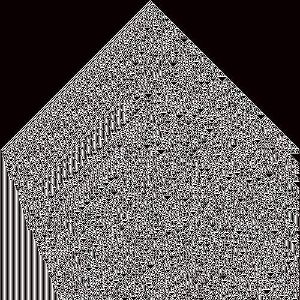
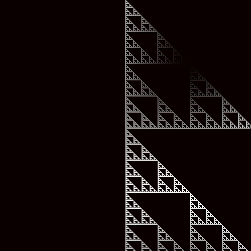
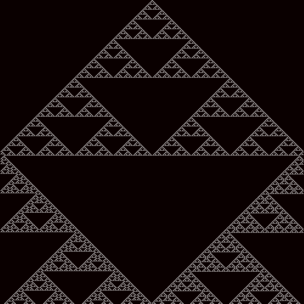

# PCBS_automate_cellulaire

##  Introduction

Le but de ce projet était de créer un automate céllulaire à une dimension. Un automate cellulaire permet de montrer comment, à partir de conditions initiales très simples et d'un nombre restreint de règles élémentaires, peuvent naitre des structures complexes.

Au démarrage, le programme ouvre une page web pour diriger l'utilisateur vers la page  consacrée aux automates cellulaires. L'utilisateur est alors invité à se renseigner sur les automates cellulaires et leurs fonctionnalités. Par la suite, l'utilisateur est invité à choisir une règle parmi les règles proposées en inscrivant le chiffre de la règle souhaitée.
Une fois le chiffre donné, le programme génère autaumatiquement une image de 500 x 500 pixels de la règle demandée. Etant donné que chaque règle possède une évolution, mais aussi des propriétés qui lui sont propres, l'utilisateur est ensuite redirigé vers une page du site web de  consacrée à la règle en question afin que l'utilisateur puisse en apprendre plus sur la règle qu'il a choisi.

##  Fonctionnement

Le but du programme est de simuler l'évolution de cellules à partir d'une population initiale, en suivant un nombre restreint de règles élémentaires qui définissent son évolution. A l'ouverture du programme, l'utilisateur est invité à choisir le numéro correspondant à l'une des règles proposées par le programme.

    wb.open('https://en.wikipedia.org/wiki/Cellular_automaton')

    print("Lisez attentivement les informations sur la page qui vient de s'afficher")

    rule_choice = int(input("Maintenant que vous en savez plus à propos des automates cellulaires, choisissez le chiffre correspondant à l'une des règles proposée entre crochet -> [Règle n°28 | Règle n°30 | Règle n°50 | Règle n°60 | Règle n°110 | Règle n°146 | Règle n°184] : "))

    rule = int(rule_choice)

Une fois le numéro entré, le programme génère automatiquement une image au format .png illustrant la règle choisie.

Pour ce faire le programme prend une population initiale correspondant à une suite d'éléments de valeur 0 à l'intérieur de laquelle la valeur 1 a été donnée à l'élément central afin d'établir les conditions intiales de l'automate :

    population = np.zeros((lenght), dtype = np.int32)
    center =  population.size // 2
    population[center] = 1

Le programme prend ensuite chaque élément de la population initiale et en fonction de la valeur de l'élément ciblé, de la valeur de l'élément qui le suit et de celui qui le précède donne la valeur 0 ou 1 à l'élément correspondant dans une seconde population qui sera la deuxième génération de l'automate.

    new_generation = np.zeros((lenght), dtype = np.int32)

La population initiale est transformée à l'aide d'une fonction qui applique la transformation de la population initiale en fonction de la règle choisie :

    def rule_generator(population):
        if rule == 28:
            new_generation = np.zeros((len(population)), dtype = np.int32)
            for i in range(1, len(population)-1):
                if population[i - 1] == 1 and population[i] == 0 and population[i + 1] == 0:
                    new_generation[i] = 1
                elif population[i - 1] == 0 and population[i] == 1 and population[i + 1] == 1:
                    new_generation[i] = 1
                elif population[i - 1] == 0 and population[i] == 1 and population[i + 1] == 0:
                    new_generation[i] = 1
                else:
                    new_generation[i] = 0
            return new_generation
        if rule == 30:
            new_generation = np.zeros((len(population)), dtype = np.int32)
            for i in range(1, len(population)-1):
                if population[i - 1] == 1 and population[i] == 0 and population[i + 1] == 0:
                    new_generation[i] = 1
                elif population[i - 1] == 0 and population[i] == 1 and population[i + 1] == 1:
                    new_generation[i] = 1
                elif population[i - 1] == 0 and population[i] == 1 and population[i + 1] == 0:
                    new_generation[i] = 1
                elif population[i - 1] == 0 and population[i] == 0 and population[i + 1] == 1:
                    new_generation[i] = 1
                else:
                    new_generation[i] = 0
            return new_generation
        if rule == 50:
            new_generation = np.zeros((len(population)), dtype = np.int32)
            for i in range(1, len(population)-1):
                if population[i - 1] == 1 and population[i] == 0 and population[i + 1] == 1:
                    new_generation[i] = 1
                elif population[i - 1] == 1 and population[i] == 0 and population[i + 1] == 0:
                    new_generation[i] = 1
                elif population[i - 1] == 0 and population[i] == 0 and population[i + 1] == 1:
                    new_generation[i] = 1
                else:
                    new_generation[i] = 0
            return new_generation
        if rule == 60:
            new_generation = np.zeros((len(population)), dtype = np.int32)
            for i in range(1, len(population)-1):
                if population[i - 1] == 1 and population[i] == 0 and population[i + 1] == 1:
                    new_generation[i] = 1
                elif population[i - 1] == 1 and population[i] == 0 and population[i + 1] == 0:
                    new_generation[i] = 1
                elif population[i - 1] == 0 and population[i] == 1 and population[i + 1] == 1:
                    new_generation[i] = 1
                elif population[i - 1] == 0 and population[i] == 1 and population[i + 1] == 0:
                    new_generation[i] = 1
                else:
                    new_generation[i] = 0
            return new_generation
        if rule == 110:
            new_generation = np.zeros((len(population)), dtype = np.int32)
            for i in range(1, len(population)-1):
                if population[i - 1] == 1 and population[i] == 1 and population[i + 1] == 1:
                    new_generation[i] = 0
                elif population[i - 1] == 1 and population[i] == 0 and population[i + 1] == 0:
                    new_generation[i] = 0
                elif population[i - 1] == 0 and population[i] == 0 and population[i + 1] == 0:
                    new_generation[i] = 0
                else:
                    new_generation[i] = 1
            return new_generation
        if rule == 146:
            new_generation = np.zeros((len(population)), dtype = np.int32)
            for i in range(1, len(population)-1):
                if population[i - 1] == 1 and population[i] == 1 and population[i + 1] == 1:
                    new_generation[i] = 1
                elif population[i - 1] == 1 and population[i] == 0 and population[i + 1] == 0:
                    new_generation[i] = 1
                elif population[i - 1] == 0 and population[i] == 0 and population[i + 1] == 1:
                    new_generation[i] = 1
                else:
                    new_generation[i] = 0
            return new_generation
        if rule == 184:
            new_generation = np.zeros((len(population)), dtype = np.int32)
            for i in range(1, len(population)-1):
                if population[i - 1] == 1 and population[i] == 1 and population[i + 1] == 1:
                    new_generation[i] = 1
                elif population[i - 1] == 1 and population[i] == 0 and population[i + 1] == 1:
                    new_generation[i] = 1
                elif population[i - 1] == 0 and population[i] == 1 and population[i + 1] == 1:
                    new_generation[i] = 1
                elif population[i - 1] == 1 and population[i] == 0 and population[i + 1] == 0:
                    new_generation[i] = 1
                else:
                    new_generation[i] = 0
            return new_generation

Cette règle de transformation est ensuite transmise à une seconde fonction qui sera en charge de l'appliquer à l'ensemble des générations. La population initiale est alors transformée selon la règle choisie pour donner une seconde génération, qui deviendra à son tour l'objet d'une nouvelle transformation selon les mêmes règles et ainsi de suite.

    def automate_generator(n_rows, n_cols):
        start = np.zeros(n_cols, dtype = np.int32)
        start[n_cols // 2] = 1
        board = np.zeros((n_rows, n_cols), dtype = np.int32)
        board[0,:] = start
        for i in range(n_rows - 1):
            current_population = board[i , :]
            board[i + 1, :] = rule_generator(current_population)
        return board

Le nombre de colonnes et de générations sont fixées à 500.

    width = 500
    lenght = 500

## Résultats

**Règle 28**

**Règle 30**

**Règle 50**

**Règle 60**

**Règle 110**

**Règle 146**

**Règle 184**

## Améliorations

Plusieurs foncitonalités du programme auraient pu être améliorées. Notamment, j'aurais aimé pouvoir prendre en compte les erreurs à l'aide d'une boucle try/except, seulement je ne suis pas parvenu à l'implémenter correctement. Lorsqu'un chiffre qui ne correspond pas aux règles proposées est rentré, le programme renvoie une erreur du type :

    TypeError: int() argument must be a string, a bytes-like object or a number, not 'NoneType'

Bien que j'ai essayé de prendre en compte cette erreur lors de l'input de la réponse de l'utilisateur, le programme continuait à renvoyer cette même erreur.

J'aurais aussi souhaiter faire en sorte que l'input ne soit proposé qu'une fois la page wikipédia qui s'ouvre au début de programme ne soit fermé. Cela aurait permis plus de lisibilité dans les instructions.
